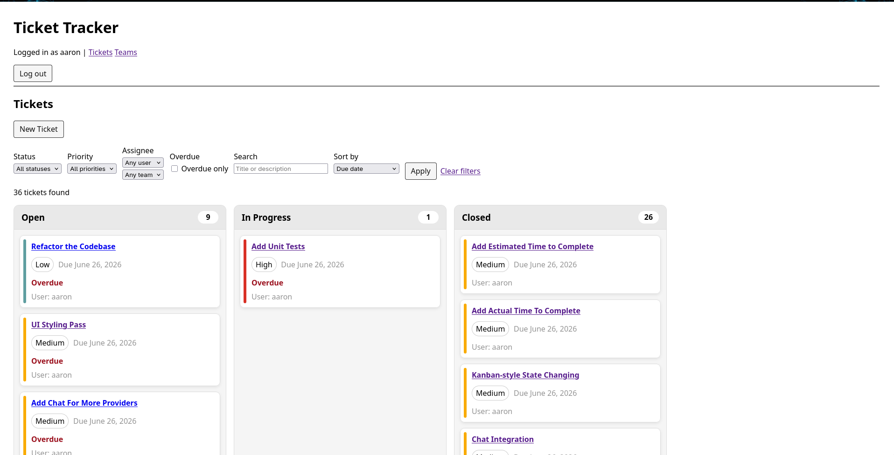
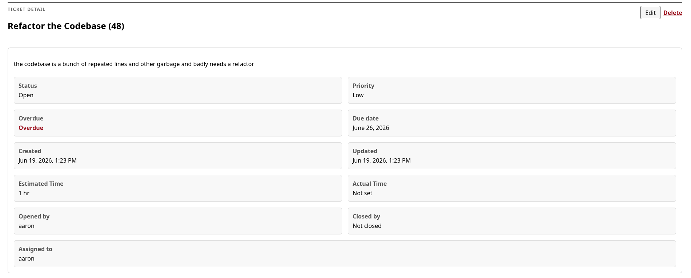
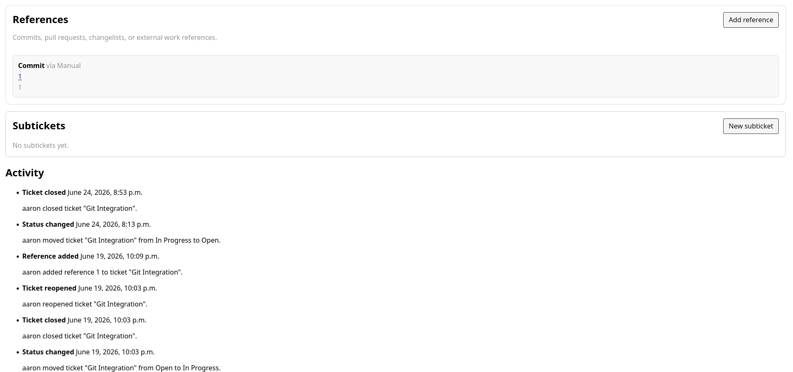
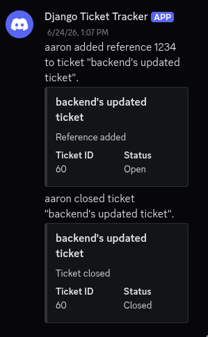

# Django Ticket Tracker

Self-hosted internal tool built to handle growing demands for managing multiple projects.

## Overview

This is a role-based ticket tracker with team support, Discord notification integration, and version-control reference tracking. I built this both to better understand existing ticket systems like Jira and to have my own tool I can customize for managing and maintaining multiple projects at the same time with small teams.

## Features

- Authentication/login flow
- Role-based permissions
- Team support
- Ticket creation, editing, detail pages, and deletion
- Status and priority tracking
- Kanban-style ticket status updates
- Nested subticket support
- Estimated time and actual time tracking
- Enforceable time estimation and time tracking
- Chat room/channel notification integration
- Granular notifications by chat channel
- Version-control reference integration
- Enforceable git commit references
- Activity logs visible on tickets and in Django admin
- Dockerized local development/demo setup

## Running

### Local Dev

1. Open a terminal at project root:
```bash
    docker compose up -d
```
2. Run migrations:
```bash
    docker compose exec web uv run python manage.py migrate
```
3. Create the admin user:
```bash
    docker compose exec web uv run python manage.py createsuperuser
```
4. The admin panel is available at http://localhost:8000/admin
5. The main app is available at http://localhost:8000/tickets

### Using

#### Teams

To create a team, use the admin panel. The team will become available to use in the teams page from the main app.
To assign to a team, you can use either the admin panel or the main app.

#### Roles

Roles are hard-coded at the moment:

- Leader is only assigned by the admin panel. Leaders have all permissions and uniquely manage their team's roles and members. Leaders also have the ability to create team-wide tickets and delete tickets within their team. A team must have exactly one leader at any given time.
- Normal is the default assigned role. Normal users can perform CRUD on all non-team-wide tickets, including subtickets within a team-wide ticket. For example, a team ticket might be "Create the shopping cart". A normal user can create subtickets such as "Sync the data from offline mode" or "Fix the last item being duplicated".
- Read-only users cannot do most CRUD operations. They can only view tickets and teams. This is the default for team assigned tickets that the user is not a member of. For example, the backend team might have a ticket "Migrate from Django to Go". A frontend team member that does not share membership with the backend team can see the ticket but cannot change its status or alter it in any way.
- Restricted users are unable to see or do anything.

#### Tickets

Tickets have the following properties:
- Every ticket must have exactly one assignment target: either an assigned team or an assigned user.
- They must have a title and description.
- Optional configs via the admin panel:
  - Enforced time estimate on creation.
  - Enforced time spent on updating the status to closed.
  - Enforced version control reference on updating the status to closed.

#### Integrations

For now the only supported chat provider is Discord:
1. Select the Discord channel to host your notifications.
2. Grab/create its webhook from the channel settings.
3. In the admin panel, create a notification channel and put in the webhook URL.
4. In the admin panel, create each notification you want to receive events for.

A generic version control reference system is provided:
1. In `.env`, update your version-control repo URL.
2. In the project root: 
```bash
    docker compose exec web uv run python manage.py integration_tokens generate --team-id <your team id> --name "<whatever you want to call it>" 
```
3. Store the generated integration token somewhere safe and never commit it to git. If you save it in a local env/config file for a hook, make sure that file is git-ignored.
4. When calling the ticket-reference endpoint from a commit hook or external integration, send the token as a bearer token:
```http
Authorization: Bearer <token>
```
sent to:
```
POST /tickets/integrations/ticket-references/
```
```JSON
{
  "ticket_id": 1,
  "kind": "commit",
  "provider": "git",
  "external_id": "abc123",
  "url": "https://example.com/commit/abc123",
  "title": "Fix ticket status transition",
  "metadata": {}
}
```

Tokens can be managed in the admin panel as well as through management commands:
- list
```bash
docker compose exec web uv run python manage.py integration_tokens list
```
```bash
docker compose exec web uv run python manage.py integration_tokens list --include-inactive
```
```bash
docker compose exec web uv run python manage.py integration_tokens list --id <number>
```
- revoke
```bash
docker compose exec web uv run python manage.py integration_tokens revoke --id <number>
```
```bash
docker compose exec web uv run python manage.py integration_tokens revoke --prefix <token prefix>
```
```bash
docker compose exec web uv run python manage.py integration_tokens revoke --token <full token>
```

## Tech Stack

- Python / Django
- PostgreSQL
- Docker
- HTML / CSS / JavaScript

## Screenshots

### Ticket List


### Ticket Detail


### Ticket Integrations


### Discord Integrations


## Future

- Add more chat channel providers
- Make git integration easier
- Improve team ticket ownership